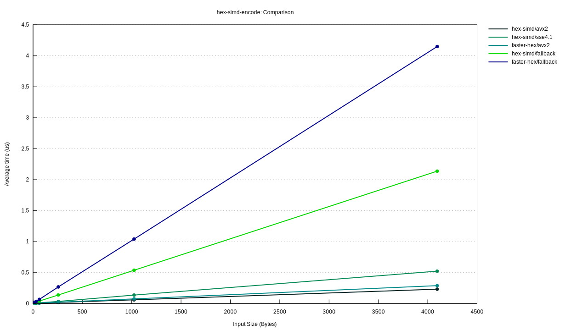
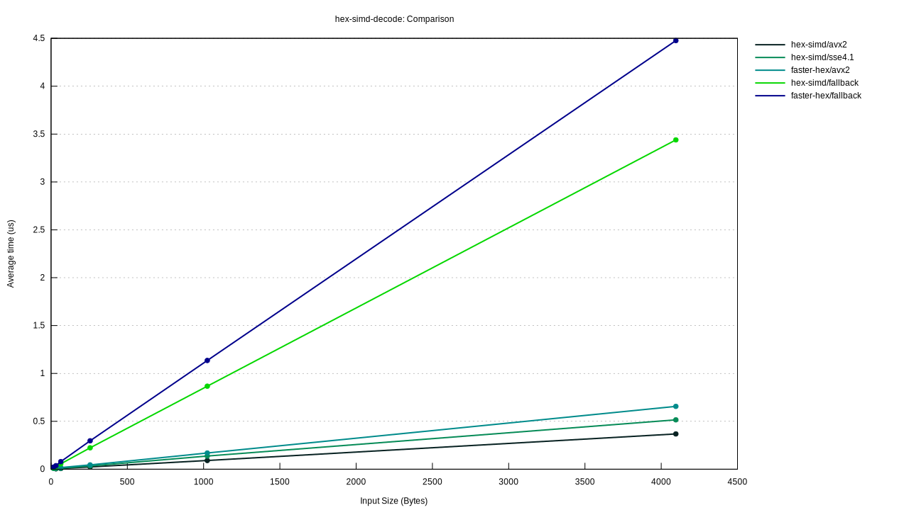
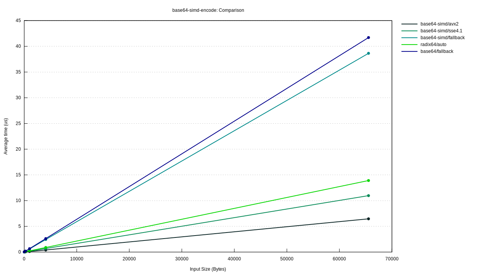

# Benchmarks v0.5.0

Rust Version: `rustc 1.59.0-nightly (b60e32c82 2021-12-30)`

CPU Name: `Intel(R) Core(TM) i5-9300H CPU @ 2.40GHz`

Benched with [Criterion.rs](https://github.com/bheisler/criterion.rs)

## uuid-simd

| Function                | Average Time |
| ----------------------- | ------------ |
| parse-simple(avx2)      | 5.3570ns     |
| parse-hyphenated(avx2)  | 7.3306 ns    |
| format-simple(avx2)     | 4.0277ns     |
| format-hyphenated(avx2) | 9.0357 ns    |

Average Time (Lower is better)

## hex-simd

| Function     | Top Throughput |
| ------------ | -------------- |
| check(avx2)  | 21.542 GiB/s   |
| encode(avx2) | 16.370 GiB/s   |
| decode(avx2) | 10.347 GiB/s   |

Average Time (Lower is better)

## base64-simd

| Function     | Top Throughput |
| ------------ | -------------- |
| encode(avx2) | 9.4362 GiB/s   |
| decode(avx2) | 10.727 GiB/s   |

Average Time (Lower is better)

